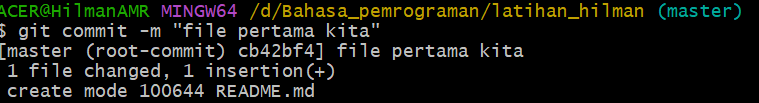
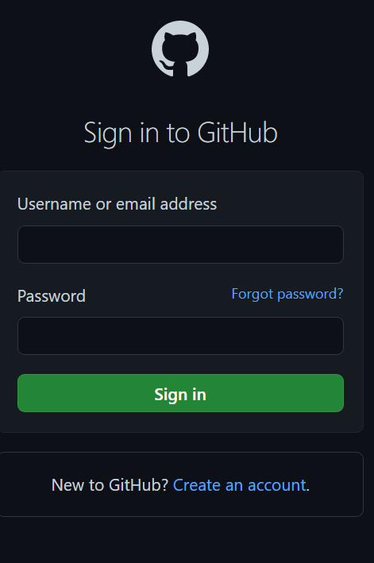

# tugas1

## tutorial git vcs

### kita membuat repositories

1. Kita buat folder di pc kita  
2. Kita ketik $mkdir latihan_hilman untuk menambahkan folder  
3. Kita pindah directory yang barusan kita buat dengan cara $cd latihan_hilman  
  
4. Kita akan inisialisasi folder git dengan cara git init  
  
5. Kita menambahkan file baru pada repository kita dengan cara $echo "#latihan buat repository" >> README.md dan file README.md telah berhasil kita buat  
  
6. Menambahkan file baru repository dengan cara $git add README.md  
  
7. Selamat kita berhasil menambahkan file baru repository  
8. Sekarang kita commit atau yang biasa kita sebut perubahan dengan cara $git commit -m "file pertama kita"  
  
9. Setelah itu kita membuat repository ke server  
10. Server repository yang kita buat menggunakan github.com  
11. Anda harus membuat akun github dulu  
  
