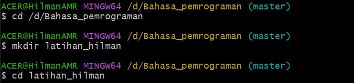
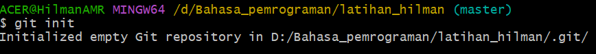
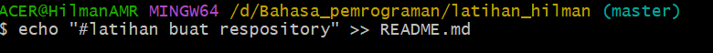

# tugas1

## tutorial git vcs

### kita membuat repositories

1. kita buat folder di pc kita  
2. kita ketik $mkdir latihan_hilman untuk menambahkan folder  
3. kita pindah directory yang barusan kita buat dengan cara $cd latihan_hilman  
  
4. kita akan inisialisasi folder git dengan cara git init  
  
5. kita menambahkan file baru pada repository kita dengan cara $echo "#latihan buat repository" >> README.md dan file README.md telah berhasil kita buat  
