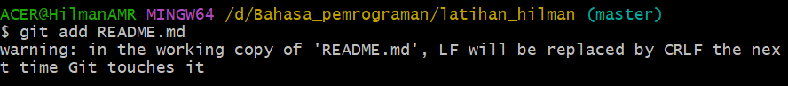

# tugas1

## tutorial git vcs

### kita membuat repositories

1. Kita buat folder di pc kita  
2. Kita ketik $mkdir latihan_hilman untuk menambahkan folder  
3. Kita pindah directory yang barusan kita buat dengan cara $cd latihan_hilman  
  
4. Kita akan inisialisasi folder git dengan cara git init  
  
5. Kita menambahkan file baru pada repository kita dengan cara $echo "#latihan buat repository" >> README.md dan file README.md telah berhasil kita buat  
  
6. Menambahkan file baru repository dengan cara $git add README.md  
  
7. Selamat kita berhasil menambahkan file baru repository  
8. Sekarang kita commit atau yang biasa kita sebut perubahan dengan cara $git commit -m "file pertama kita"  
  
9. Setelah itu kita membuat repository ke server  
10. Server repository yang kita buat menggunakan github.com  
11. Anda harus membuat akun github dulu  
  
12. Setelah anda berhasil membuat akun github anda pada halaman beranda klik start project lalu buat new repository dan buat servernya  
  
13. Menambahkan remote repository dengan cara $git remote add origin url  
(biasanya akan ada perintah untuk memasukan link akun github untuk konek ke server)  
  
catatan link url nya adalah link repository github yang tadi kita buat  
  
14. Mengirim perubahan ke server dengan cara $git push -u origin master/main  
  
15. Buka akun github anda dan lihat pada repository nya, maka akan muncul perubahan di situ  
  
   

<i>sekian tutorial singkat ini saya ucapkan terima kasih, semoga bermanfaat</i>